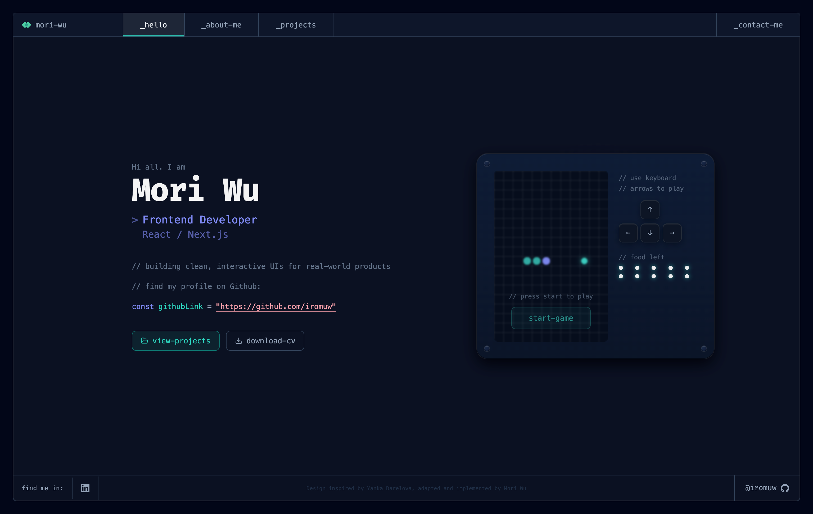

# Portfolio 2.0 — Mori Wu



A modern personal portfolio built with Next.js, TypeScript, and Tailwind CSS. The design is inspired by UI/UX designer [**Yanka Darelova**](https://www.darelova.com/).

## Features

- IDE-themed UI with VS Code-like layout (activity bar, file tree, content panels)
- Animated intro overlay on page load — SVG logo draw animation
- Interactive Snake game on the homepage
- Projects showcase with filterable grid and detail panel
- About section with file-tree navigation and syntax-highlighted code snippets (Shiki)
- Contact page with live code preview and Web3Forms integration
- Custom 404 page with code-block aesthetic
- Fully responsive layout (mobile menu, adaptive panels)
- GA4 event tracking system (page views, clicks, scroll depth, time-on-page, high-intent signals)

## Tech Stack

- [Next.js 15](https://nextjs.org/) — React framework (Pages Router)
- [TypeScript](https://www.typescriptlang.org/)
- [Tailwind CSS](https://tailwindcss.com/) — Utility-first CSS
- [Shiki](https://shiki.matsu.io/) — Syntax highlighting
- [next-i18next](https://github.com/i18next/next-i18next) — i18n for Next.js
- [Lucide React](https://lucide.dev/) — Icon library
- [Web3Forms](https://web3forms.com/) — Contact form submissions
- [Google Analytics 4](https://analytics.google.com/) via `@next/third-parties` — event tracking
- [Vercel Analytics](https://vercel.com/analytics) — page view analytics

## Getting Started

```bash
npm install
npm run dev
```

Open [http://localhost:3000](http://localhost:3000).

## Project Structure

```
├── content/                   # Static site content (TypeScript data files)
│   ├── about/
│   │   ├── personal/          # Bio, education, interests
│   │   └── professional/      # Experience, skills, certificates
│   └── projects/              # Per-project data files + shared types
├── public/
│   ├── favicon.svg            # MW diamond logo (filled)
│   ├── welcome.svg            # MW logo draw animation (intro overlay)
│   ├── resume.pdf
│   └── locales/
│       ├── en/common.json
│       └── zh/common.json
└── src/
    ├── components/
    │   ├── IntroOverlay.tsx    # Full-screen animated intro on page load
    │   └── layout/
    │       ├── Layout.tsx
    │       ├── Navbar.tsx
    │       ├── Footer.tsx
    │       └── MobileMenu.tsx
    ├── pages/
    │   ├── _app.tsx
    │   ├── _document.tsx
    │   ├── index.tsx           # _hello — hero + Snake game
    │   ├── about.tsx           # _about-me — IDE file explorer
    │   ├── projects.tsx        # _projects — filterable project grid
    │   ├── contact.tsx         # _contact-me — form + code preview
    │   └── 404.tsx
    ├── sections/
    │   ├── hello/              # HeroLeft, SnakeGame, GameControls
    │   ├── about/              # ActivityBar, FileTree, ContentPanel, SnippetCard
    │   ├── projects/           # ProjectGrid, FeaturedProjectCard, DetailPanel, filters
    │   └── contact/            # ContactForm, CodePreview, ContactSidebar
    ├── hooks/
    │   ├── usePageViewTracking.ts  # Explicit page_view_* events per route
    │   ├── useScrollTracking.ts    # scroll_depth events at 25/50/75/100%
    │   └── useTimeOnPage.ts        # time_on_page events at 30s and 60s
    ├── lib/
    │   ├── analytics.ts            # trackEvent() — central GA4 wrapper
    │   ├── engagementSignal.ts     # engagement_high_intent state machine
    │   ├── trackExternalLink.ts    # Unified click_external event + engagement signals
    │   └── highlight.ts            # Shiki highlight helpers
    └── styles/
        └── globals.css
```

## Analytics

The project uses a layered GA4 event tracking system built on top of `@next/third-parties/google`.

| Layer | File | Purpose |
|---|---|---|
| Core | `src/lib/analytics.ts` | `trackEvent(name, params?)` — safe gtag wrapper, dev console logging |
| Outbound links | `src/lib/trackExternalLink.ts` | Unified `click_external` event with `type` + `location` params |
| High-intent | `src/lib/engagementSignal.ts` | Fires `engagement_high_intent` once per page when conditions are met |
| Page views | `src/hooks/usePageViewTracking.ts` | `page_view_home/projects/contact/about` per route |
| Scroll | `src/hooks/useScrollTracking.ts` | `scroll_depth` at 25 / 50 / 75 / 100% |
| Dwell time | `src/hooks/useTimeOnPage.ts` | `time_on_page` at 30s and 60s |
| Orchestrator | `src/components/PageTracker.tsx` | Mounts all hooks; resets per route via `key={pathname}` in `_app.tsx` |

**High-intent signal** (`engagement_high_intent`) fires once per page session when any of these conditions are met:
- Scrolled ≥ 75% **and** spent ≥ 60s on page
- Clicked a project card **and** clicked an external project link
- Clicked email or LinkedIn (direct contact intent)

## Design Credits

UI design inspired by a Figma template by [**Yanka Darelova**](https://www.darelova.com/).
